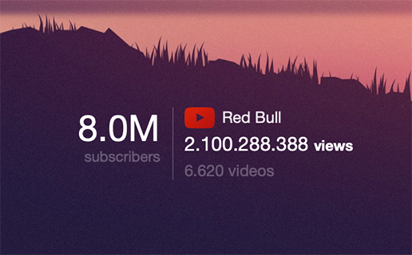

Übersicht | Youtube Widget
=================
:closed_book: [Übersicht Homepage](http://tracesof.net/uebersicht/)
&nbsp;&nbsp;&nbsp;:pushpin: [Übersicht Widgets](http://tracesof.net/uebersicht-widgets/)
&nbsp;&nbsp;&nbsp;:page_facing_up: [Widgets GitHub Repo](https://github.com/felixhageloh/uebersicht-widgets)

Widget who display public statistics of an __Youtube__ user channel on your Mac OS X desktop with [Übersicht](http://tracesof.net/uebersicht/).

## June 2015: The widget no longer works and I doesn't have time to work on it for the moment... Youtube changed the API 1/2 month ago and stopped the simple way I used before to retrieve information.




## Installation

Put the widget into the __Übersicht Widget folder__ and the folder which contains __the NodeJS script elsewhere__.

I have a folder for the __Übersicht widget__, and a folder for the __Command Scripts__ like this:

<p>
:open_file_folder: <b>Ubersicht</b><br>
&nbsp;&nbsp;&nbsp;&nbsp;&nbsp;&nbsp;&nbsp;&nbsp;:file_folder: Widgets<br>
&nbsp;&nbsp;&nbsp;&nbsp;&nbsp;&nbsp;&nbsp;&nbsp;:file_folder: Command<br>
</p>

## Change command path
Change the __absolute path of the command__ in the widget script.
```
command: "/usr/local/bin/node /full/path/to/the/Command/Youtube/youtube.js"
```

## config.json
Edit the __config.json__ located in the command folder to personalise the widget.

```
{
    "user": {
        "username":"youtube",
        "show_name":true,
        "lang":"FR"
    },
    "theme": {
        "backcolor":"rgba(0,0,0,0.0)",
        "position": "BL|0|20",
        "logo_opacity":0.5
    }
}

```

* __username:__ Your Youtube username
* __show_name:__ Display the Username if true or a __Youtube__ label
* __lang:__ Localization, can be __US__ or __FR__ _(defaut: US)_
* __backcolor:__ Widget color background
* __position__: 
    - Top Left:  ```TL|left_margin|top_margin```
    - Top Right: ```TR|right_margin|top_margin```
    - Bottom Left: ```BL|left_margin|bottom_margin```
    - Bottom Right: ```BR|right_margin|bottom_margin```
    - Center on screen: ```C|0|0```
* __logo_opacity:__ Logo and username opacity value


